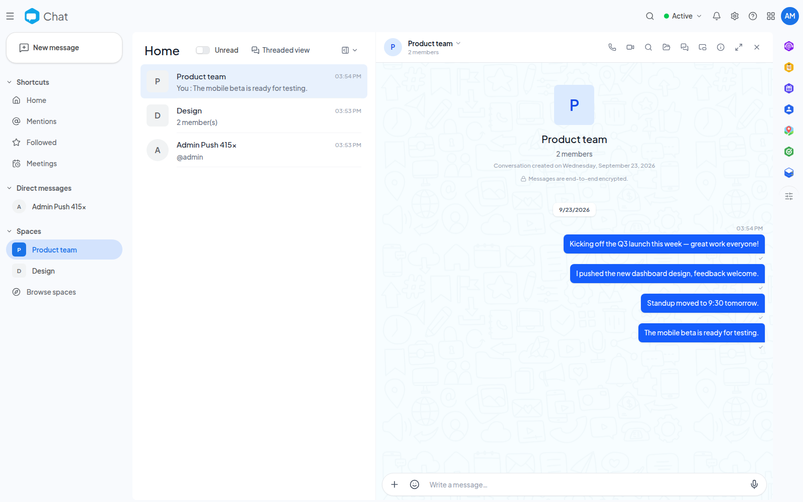

<!--
  SPDX-FileCopyrightText: 2026 Kubuno contributors
  SPDX-License-Identifier: AGPL-3.0-or-later
-->

<div align="center">


# Kubuno — Chat

[](LICENSE)


**Real-time messaging, meetings and calls for [Kubuno](https://github.com/kubuno/core) — the self-hosted, libre (AGPLv3) cloud platform, a sovereign alternative to Google Workspace and Microsoft 365.**

Direct messages and group spaces, a rich composer, audio/video calls and
full-featured meeting rooms — kept running as a floating overlay while you browse
the rest of the platform.

</div>

---

## Screenshots



<sub>A group conversation, with the space and direct-message list</sub>

## Features

- **Direct messages & spaces** — a sidebar organized into Shortcuts, Direct messages and Spaces, a central Home view, dedicated Mentions and Starred views, and a browse page to discover and join public spaces. Every view and conversation has a real, shareable URL.
- **Rich composer** — an expression panel with the full Unicode emoji catalogue (localized keyword search, recently-used row), GIF search through a server-side proxy (the API key is an admin-only instance setting, never exposed to the browser), and a personal sticker pack. Messages support replies, reactions, polls, attachments and link previews.
- **Sticker Studio** — turn any picture into a transparent square sticker; the pack lives on the device (IndexedDB).
- **Camera capture** — take a photo or record a clip straight from the composer.
- **Presence & status** — Active / Away / Do not disturb plus a free-text status, picked from the platform top bar and broadcast live over WebSocket; a manually chosen status survives reconnects.
- **Conversation management** — pin, archive, mute, favorite, mark as unread, clear or delete from a single action menu, plus a per-conversation shared-files panel and multi-device live sync (a message you send appears at once on your other tabs and devices).
- **Pop-up conversations** — small floating chat windows docked to a corner of the screen that keep running while you browse other Kubuno modules.
- **Audio & video calls** — a global call overlay that follows you across modules, with a lobby to preview and pick devices, screen sharing alongside your camera, and an upgrade from audio to video without hanging up. STUN/TURN servers are an instance setting, so a self-hosted deployment chooses its own; with nothing configured, calls connect between hosts that can reach each other directly.
- **Meeting rooms** — a full-width **Meetings** page with a navigable week strip, upcoming/past grouping, multi-select to act on several meetings at once (including deletion), and a details panel (members, plain transcript) you can read without joining. Meetings offer a lobby, a dark meeting stage with animated tile layout, an active-speaker highlight, presentation controls, host moderation (mute/remove, and ending the meeting for everyone as distinct from leaving it), a meeting chat that is the conversation itself, an admit-based access mode (open, or open to trusted people with a join queue), configurable host rules (who may share, react or write in chat), in-meeting activities other modules can register, and optional recording filed to the recorder's Drive.
- **Calendar meetings** — a calendar event can carry a Kubuno video call created in place; the event and its meeting keep one shared title, and a room attached to an event you never save is cleaned up automatically.
- **Push notifications** — new messages and incoming calls ring registered devices via the core (UnifiedPush); notifications carry *who*, never *what*, and respect mute / Do-not-disturb and per-module preferences.
- **Cross-module data cards** — content copied from another Kubuno module (a map location, a drawing…) pastes as a rich card rendered by the producer module, with a graceful generic fallback. Chat also contributes "Chat" and "Start a meeting" actions to a person's card wherever the platform shows one.

## Architecture

Chat is a **Kubuno module**: a standalone Rust process (port `3109`) that registers with the [core](https://github.com/kubuno/core) at startup. The core proxies its routes (`/api/v1/chat/*`) and serves its runtime-loaded frontend bundle.

```
core (kubuno/core)  ──proxy──►  kubuno-chat (this repo, :3109)
       │                              ├─ Rust backend (Axum + kubuno-db, schema `chat`)
       └─ serves /modules/chat/entry.js (React frontend, loaded at runtime)
```

- **Backend** — `src/`: Axum on the shared `kubuno-db` layer, running on **PostgreSQL, MySQL/MariaDB or SQLite** (the engine is an administrator choice read at run time — one binary, no rebuild), in a dedicated `chat` schema; migrations in `migrations/`. Calls exchange media directly between browsers (WebRTC).
- **Frontend** — `frontend/`: a React bundle built to `entry.js`, consuming `@kubuno/sdk`, `@kubuno/ui` and `@kubuno/drive` from npm (provided by the host at runtime via the import map).

## Install

Modules install as a **Kubuno package (`.kbpkg`)** — a single, self-contained archive the Kubuno server unpacks itself (in pure Rust, identically on Linux, Windows and macOS). There are no native system packages for a module; only the core ships those.

The easiest way to self-host a full Kubuno instance (core + every module) is the **all-in-one [Docker image](https://github.com/kubuno/docker)** (`ghcr.io/kubuno/kubuno`), which already bundles Chat.

To build and install this module on its own:

```bash
bash build_kbpkg.sh --install        # build → install into the store → restart the core
```

Or install a prebuilt `.kbpkg` (offline, no catalogue required):

```bash
sudo kubuno modules:install dist/chat-<version>-<os>-<arch>.kbpkg
sudo systemctl restart kubuno        # the core loads the module on (re)start
```

A `.kbpkg` is attached to every tagged [GitHub Release](https://github.com/kubuno/chat/releases) (Linux via `build.yml`, Windows/macOS via `dist.yml`).

## Build & development

**Requirements:** Rust ≥ 1.82, Node.js ≥ 24, and a database: PostgreSQL 16, MySQL/MariaDB or SQLite.

```bash
cargo build --release                      # → target/release/kubuno-chat
cd frontend && npm ci && npm run build      # → dist/{entry.js, entry.css}
bash build_kbpkg.sh                         # → dist/chat-<version>-<os>-<arch>.kbpkg
```

> Shared dependencies come from Kubuno — no `kubuno/core` checkout required:
> - **Rust** — shared crates via tagged git dependencies on `kubuno/core`.
> - **Frontend** — `@kubuno/sdk`, `@kubuno/ui`, `@kubuno/drive` from the `@kubuno` npm scope. They are `external` at runtime (the host provides the singletons via its import map); the npm packages supply the build-time type surface.

## Tech stack

Rust 2021 · Axum 0.7 · Tokio · `kubuno-db` over SQLx (PostgreSQL, MySQL/MariaDB or SQLite, schema `chat`) · WebSocket · WebRTC — React 19 · TypeScript · Vite · Tailwind CSS v4 · Zustand · React Query.

## Contributing

Issues and pull requests are welcome. For any significant change, please open an issue first.

## License

[AGPL-3.0-or-later](LICENSE) © Kubuno contributors.
